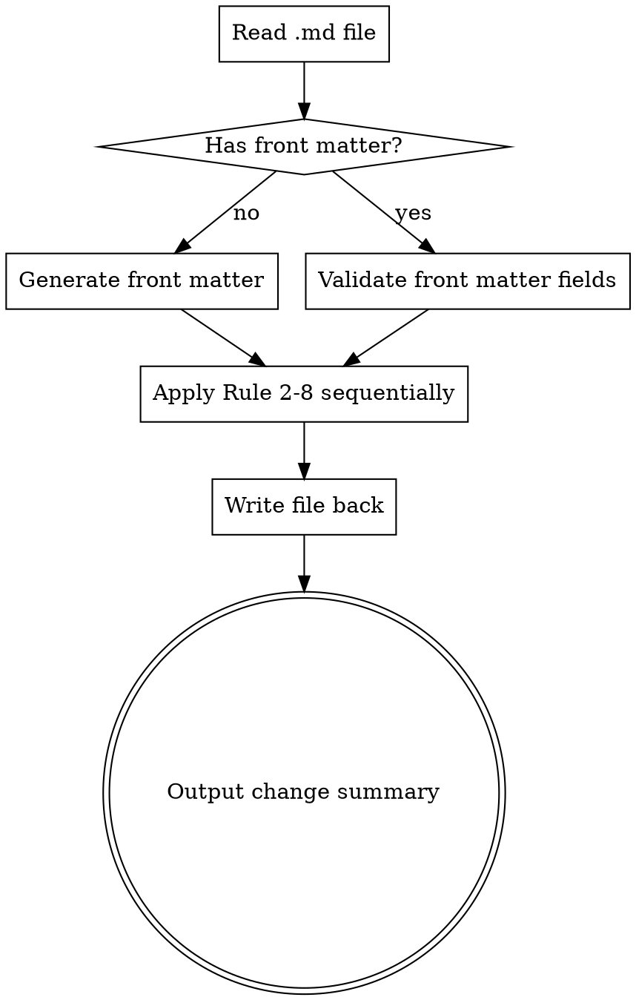

# Blog Format Check

Format-only modifications for Markdown blog articles. Never change content, wording, or semantics.

## When to Use

- User asks to check, format, beautify, or lint a blog article
- User references a `.md` blog post and asks for formatting help
- User says "检查格式", "美化文章", "format blog"

## Execution Flow



## Protected Zones — DO NOT MODIFY

Before applying ANY rule, identify these zones and skip them entirely:

- Content inside fenced code blocks (between `` ``` `` pairs)
- Content inside inline code (between `` ` `` pairs)
- Content inside blockquotes (`>` lines)

Never change wording, meaning, or semantics of any text anywhere.

## Format Rules Checklist

Apply rules in this exact order. For each rule, scan the entire document (skipping protected zones) and fix ALL violations.

### Rule 1: YAML Front Matter

Check if `---` delimited front matter exists at the very start of the file.

**If missing**, generate it. Infer `title` from the first heading or filename. Use today's date:

```yaml
---
title: "<inferred title>"
date: YYYY-MM-DD
author: ""
tags: []
categories: []
draft: true
---
```

**If exists**, check all 6 required fields are present. Add missing ones with defaults above. Validate:

- `date` is `YYYY-MM-DD` format
- `tags` and `categories` are YAML arrays (not comma-separated strings)
- `draft` is a boolean

### Rule 2: Heading Hierarchy

- **Remove** any `# (h1)` in the body — h1 is reserved for the front matter `title`
- **Flatten** `#### (h4)` and deeper to `### (h3)` — maximum heading depth is h3
- **Fix skipped levels**: h2 jumping to h4 must become h2 → h3
- One blank line before and after every heading

**Baseline gap addressed:** Without this rule, Claude converts h4 to h2 (wrong) and keeps h1 in body.

### Rule 3: CJK-Latin Spacing (Pangu)

This rule is frequently missed without explicit instruction. Apply carefully:

- Chinese + English letters: `中文English` → `中文 English`
- Chinese + numbers: `共3个` → `共 3 个`
- Do NOT add spaces between Chinese characters and Chinese punctuation
- Do NOT add spaces inside technical terms like `C++`, `node.js`, `iOS`
- Chinese context uses full-width punctuation：，。！？：；（）
- English context uses half-width punctuation: , . ! ? : ; ( )

### Rule 4: Paragraphs and Blank Lines

- Collapse 2+ consecutive blank lines to exactly 1
- Exactly 1 blank line between paragraphs
- No blank lines between consecutive list items (compact lists)
- Exactly 1 blank line before and after fenced code blocks
- Exactly 1 blank line before and after headings

### Rule 5: List Formatting

- Replace ALL `*` and `+` list markers with `-` — no exceptions
- Ordered lists: `1.`, `2.`, `3.` (incrementing)
- Nested indent: exactly 2 spaces
- **Flatten nesting deeper than 2 levels** to 2 levels — this is frequently missed

### Rule 6: Code Blocks

- Fenced code blocks MUST have a language identifier
  - Infer from content if obvious (e.g., `js`, `python`, `bash`, `html`, `css`)
  - Use `text` if unclear
- Never modify code content inside blocks
- Inline code: single backtick wrapping

### Rule 7: Links and Images

Do NOT rationalize these as "intentional placeholders." They are formatting errors. Fix them:

- Empty link text `[](url)` → use domain name or URL path as text: `[example.com](https://example.com)`
- Images without alt text `` → add descriptive alt: ``
- Verify bracket/parenthesis pairing is correct

**Baseline gap addressed:** Without this rule, Claude rationalizes empty links as "likely intentional."

### Rule 8: Formatting Consistency

- `__text__` → `**text**` (bold)
- `_text_` → `*text*` (italic) — BOTH underscore forms must be converted, not just bold
- Horizontal rules: normalize to `---`
- File ends with exactly one newline character (no trailing blank lines, no missing newline)

**Baseline gap addressed:** Without this rule, Claude normalizes bold but leaves italic underscore as-is.

## Output

After applying all rules, output a brief summary listing only rules where changes were made:

```text
## 格式修改摘要

- ✅ 添加了 YAML front matter
- ✅ 修正了 2 处标题层级
- ✅ 添加了 5 处中英文空格
- ✅ 合并了 3 处多余空行
- ✅ 统一了列表标记为 `-`
- ✅ 为 1 个代码块添加了语言标识
- ✅ 修复了 1 个空链接文本
- ✅ 统一了粗体/斜体语法
```

If no changes needed: "格式检查完成，无需修改。"
